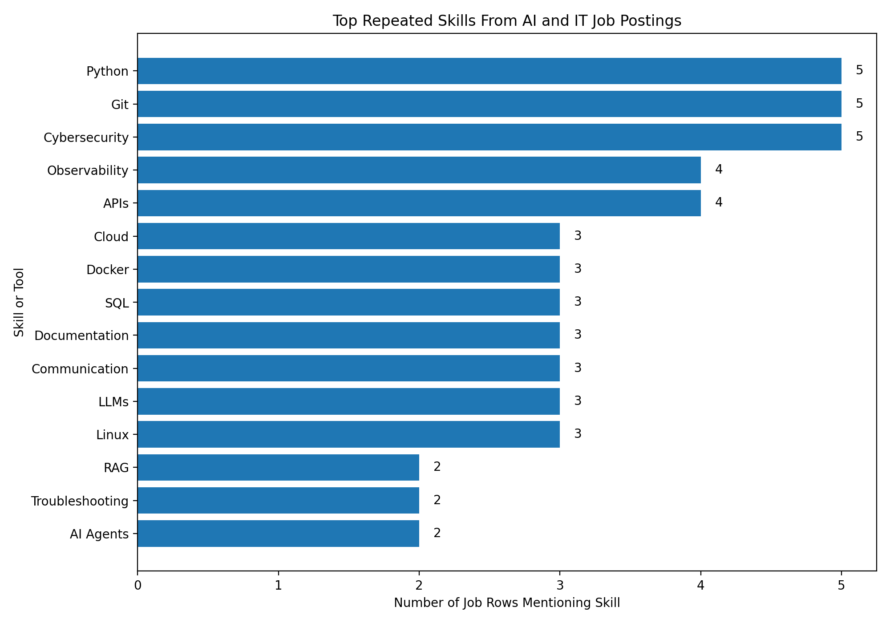

# Job Skills Analyzer

## Project Overview

This project analyzes real AI, IT, data, cloud, and cybersecurity job postings to identify which skills employers are asking for most often.

The goal of this project is to help me prepare for the real job market while completing my BSc IT degree. Instead of only guessing what skills are important, I collected job market data and used Python to analyze repeated skill patterns.

## Why I Built This Project

After discussing the gap between university learning and real-world job requirements, I wanted to understand what employers are actually asking for in current job postings.

This project helped me answer questions such as:

* What skills appear most often in AI and IT job postings?
* Is Python important for AI and IT roles?
* How often do employers mention Git, cloud, cybersecurity, APIs, and documentation?
* What should I focus on learning before graduation?

## Files in This Project

* `ai_career_real_jobs_tracker.xlsx`
  The job market spreadsheet containing real job roles and required skills.

* `analyze_job_skills.py`
  The Python script that reads the spreadsheet and counts repeated skills/tools.

* `top_skills_report.csv`
  A CSV version of the skill frequency report.

* `top_skills_report.txt`
  A text report showing the top repeated skills.

* `job_skills_tracker.csv`
  A starter CSV file for tracking job postings.

* `README.md`
  This project explanation file.

## Main Findings

The top repeated skills from the job tracker were:

1. Python
2. Git
3. Cybersecurity

Other important skills and tools included:

* APIs
* Cloud
* Docker
* SQL
* Documentation
* Communication
* LLMs
* Linux
* Observability
* RAG
* Troubleshooting
* AI Agents

## What This Means

The job market is not only asking for AI theory. It is asking for practical technical ability.

For an AI-focused BSc IT student, this means I should build practical skills in:

* Python programming
* Git and GitHub
* Cybersecurity awareness
* APIs
* SQL
* Cloud platforms
* Docker
* Linux basics
* Documentation
* Communication
* AI tools such as LLMs and RAG

## How to Run This Project

Install the required Python packages:

```bash
py -m pip install pandas openpyxl
```

Run the analysis script:

```bash
py analyze_job_skills.py
```

After running the script, it generates:

```txt
top_skills_report.csv
top_skills_report.txt
```

## Skills Demonstrated

This project shows that I can:

* Collect real job market data
* Organize data in a spreadsheet
* Use Python to analyze data
* Work with Excel and CSV files
* Identify repeated industry skills
* Document technical work clearly
* Use Git and GitHub for portfolio evidence
* Turn career research into a practical data project

## Career Value

This project is part of my AI and IT career preparation portfolio.

It shows that I am not only studying for a degree, but also building practical evidence that matches what employers are asking for in real job postings.

## Next Improvements

Future improvements for this project include:

* Add more job postings to increase accuracy
* Create charts showing skill frequency
* Build a small dashboard using Power BI or Python
* Track how job requirements change over time
* Separate the analysis by role type, such as AI Engineer, Data Analyst, Cybersecurity Analyst, and Cloud Support Engineer
* Add a simple web dashboard version of the project

## Results Chart

The chart below shows the most repeated skills and tools found in the job market sample.




## Role-by-Role Skill Analysis

In Version 2 of this project, I added a role-by-role analysis.

The first version answered:

"What skills appear most often overall?"

The second version answers:

"What skills appear most often for each job role?"

This is important because different roles require different skill combinations. For example:

- AI Engineer roles may focus more on Python, LLMs, RAG, APIs, and cloud.
- Data Analyst roles may focus more on SQL, Excel, dashboards, reporting, and communication.
- Cybersecurity Analyst roles may focus more on security, IAM, incident response, logs, and monitoring.
- Cloud Support roles may focus more on troubleshooting, cloud platforms, documentation, and customer support.
- Python Developer roles may focus more on Python, APIs, Git, testing, and backend development.

## Version 2 Files

- `analyze_skills_by_role.py` - Python script that analyzes skills by role.
- `role_by_role_skill_report.csv` - CSV output showing skills grouped by job role.
- `role_by_role_skill_report.txt` - Text report showing the top skills for each role.

## What I Learned From Version 2

The overall skill report showed that Python, Git, and Cybersecurity appeared most often.

The role-by-role report makes the project more useful because it shows that I should not learn skills randomly. I should learn skills based on the type of job I want first.

For my AI career path, this means my learning order should be:

1. Python
2. Git and GitHub
3. Cybersecurity basics
4. APIs
5. SQL
6. Cloud basics
7. Docker
8. LLMs and RAG
9. Logging and observability
10. Documentation and communication

## Role-by-Role Skill Analysis

In Version 2 of this project, I added a role-by-role analysis.

The first version answered:

"What skills appear most often overall?"

The second version answers:

"What skills appear most often for each job role?"

This is important because different roles require different skill combinations. For example:

- AI Engineer roles may focus more on Python, LLMs, RAG, APIs, and cloud.
- Data Analyst roles may focus more on SQL, Excel, dashboards, reporting, and communication.
- Cybersecurity Analyst roles may focus more on security, IAM, incident response, logs, and monitoring.
- Cloud Support roles may focus more on troubleshooting, cloud platforms, documentation, and customer support.
- Python Developer roles may focus more on Python, APIs, Git, testing, and backend development.

## Version 2 Files

- `analyze_skills_by_role.py` - Python script that analyzes skills by role.
- `role_by_role_skill_report.csv` - CSV output showing skills grouped by job role.
- `role_by_role_skill_report.txt` - Text report showing the top skills for each role.

## What I Learned From Version 2

The overall skill report showed that Python, Git, and Cybersecurity appeared most often.

The role-by-role report makes the project more useful because it shows that I should not learn skills randomly. I should learn skills based on the type of job I want first.

For my AI career path, this means my learning order should be:

1. Python
2. Git and GitHub
3. Cybersecurity basics
4. APIs
5. SQL
6. Cloud basics
7. Docker
8. LLMs and RAG
9. Logging and observability
10. Documentation and communication
